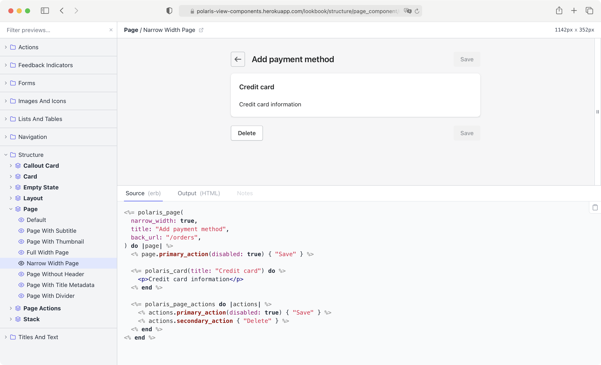

# Polaris ViewComponents

Polaris ViewComponents is an implementation of the Polaris Design System using [ViewComponent](https://github.com/github/view_component).



## Preview

https://polarisviewcomponents.org

## Usage

Render Polaris ViewComponents:

```erb
<%= polaris_card(title: "Title") do %>
  <p>Card example</p>
<% end %>
```

## Dependencies

- [Stimulus](https://stimulus.hotwired.dev/)

## Installation

Add `polaris_view_components` to your Gemfile:

```bash
bundle add polaris_view_components
```

Run installer:
```bash
bin/rails polaris_view_components:install
```

## Upgrade

Check out [UPGRADING.md](UPGRADING.md) for upgrade instructions.

## Development

To get started:

1. Run: `bundle install`
1. Run: `yarn install`
1. Run: `bin/dev`

It will open demo app with component previews on `localhost:4000`. You can change components and they will be updated on page reload. Component previews located in `demo/test/components/previews`.

To run tests:

```bash
rake
```

## Releases

The library follows [semantic versioning](https://semver.org/). To draft a new release you need to run `bin/release` with a new version number:

```bash
bin/release VERSION
```

Where the VERSION is the version number you want to release. This script will update the version in the gem and push it to GitHub and Rubygems automatically.

To release a new version of npm package update the package.json file with the new version number and run:

```bash
npm run release
```

After that make sure to commit changes in package.json.

## License

The gem is available as open source under the terms of the [MIT License](https://opensource.org/licenses/MIT).
