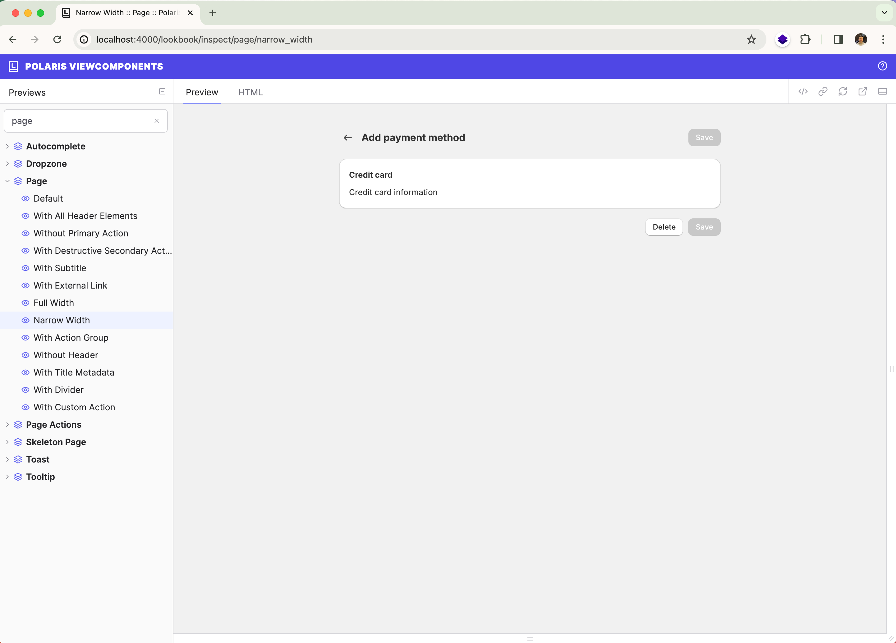

# Polaris ViewComponents

Polaris ViewComponents is an implementation of the Polaris Design System using [ViewComponent](https://github.com/github/view_component).



> **This library is under active development. Breaking changes are likely until stable release.**

## Preview

https://polarisviewcomponents.org

## Usage

Render Polaris ViewComponents:

```erb
<%= polaris_card(title: "Title") do %>
  <p>Card example</p>
<% end %>
```

## Dependencies

- [Stimulus](https://stimulus.hotwired.dev/)

## Installation

Add to `Gemfile`:

```ruby
gem "polaris_view_components"
```

Run installer:
```bash
bin/rails polaris_view_components:install
```

## Development

To get started:

1. Run: `bundle install`
2. Run: `bin/dev`

It will open demo app with component previews on `localhost:4000`. You can change components and they will be updated on page reload. Component previews located in `demo/test/components/previews`.

To release gem run:
```bash
script/release
```

To release npm package run:
```bash
npm run release
```

## License

The gem is available as open source under the terms of the [MIT License](https://opensource.org/licenses/MIT).
